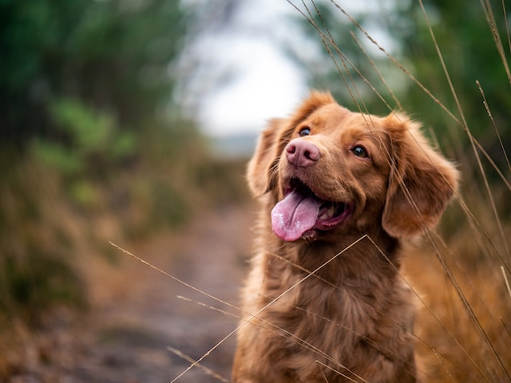
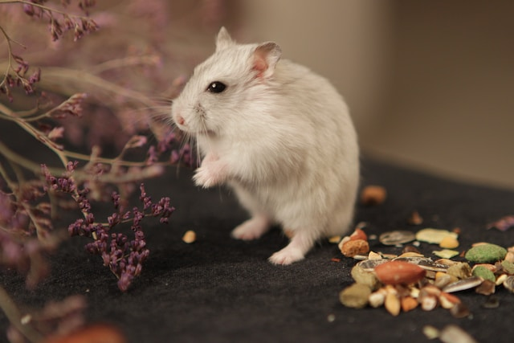

???+ info "Hinweis: Tabs nutzen um Platz in der Höhe zu sparen"
    Im Beispiel der Haustiere wird eine [Tabumgebung (Content Tabs) :octicons-link-external-16:](https://squidfunk.github.io/mkdocs-material/reference/content-tabs/) verwendet. Innerhalb der Tabs sind 3 Beispiele für Bilderintegration im Fließtext (linksbündig, rechtsbündig) und ein zentiertes Bild samt Bildunterschrift.

#
Treue Begleiter sind unsere **Haustiere**[^1]:

=== ":dog: Hund Horst"
    { align=right style="width:300px"}

    **Hund Horst** liebt lange Spatziergänge am Strand und jagdt leidenschaftlich gerne Möwen.

    Je nach Ausbeute des Fangs integrieren wir das frischgewonnene Jagdgut dynamisch in unserer Würstchenproduktion.

=== ":cat: Katze Karl"
    { align=left style="width:300px"}

    **Katze Karl** liegt den gesamten Tag hinter unserer Fritteuse und haart übermäßig.

    Am Jahresende werden die Haare zusammengekehrt und daraus Untersetzer gefilzt.

=== ":mouse: Maus Matze"
    Die Funktion von Maus Matze dient lediglich dazu, ein zentriertes Bild samt Bildunterschrift zu vderdeutlichen.

    <figure>
      { align=left style="width:300px"}
      <figcaption markdown>**Portrait:** Unser neckischer Nager</figcaption>
    </figure>

[^1]: Fußnotenbeispiel: Tiere dürfen in der Mittagspause am warmen Ofen schlafen.
